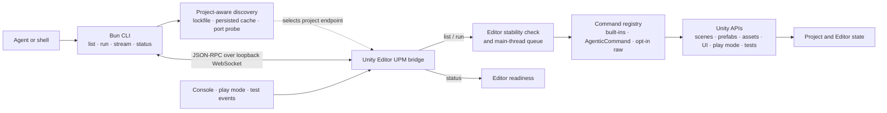

# Unity Agentic Tools

Unity Agentic Tools is a compact command runner for AI agents and scripts that need to inspect, change, and verify a Unity project through an already-running Unity Editor.

The project has two runtime components:

- a Bun/TypeScript CLI with seven top-level commands: `list`, `run`, `stream`, `install`, `uninstall`, `cleanup`, and `status`
- a Unity 2022.3+ UPM package that executes commands inside the Editor on Unity's main thread

Its automation scope starts with an existing project. Installing or removing the bridge can happen while the project is closed; every bridge-backed Unity operation targets an open Editor. The tool does not install Unity Editors or modules, manage licenses, or replace a CI build service. Project-specific build and tooling workflows can still join the same runner through `[AgenticCommand]`.

## How It Works



`install` is the setup path: it adds the UPM bridge to the target project's package manifest. After Unity loads the package, the bridge starts through `[InitializeOnLoad]` and advertises the local Editor session under `.unity-agentic/`.

The supported operating loop is:

1. Check the Editor with `status`.
2. Discover a focused command set with `list <query> --brief`.
3. Inspect current state with `query.*`, `scene.hierarchy`, `ui.snapshot`, screenshots, or logs.
4. Change state with `run <target> ...`.
5. Verify the result with a matching query, screenshot, test, or event stream.

### Local security model

The bridge binds only to loopback and is intended for a trusted local development machine. The supported CLI requires `--raw` for unregistered public static members, but the bridge is not an authentication boundary for other local processes that speak its JSON-RPC protocol directly.

## What It Provides

- **One command runner** — built-in aliases, project `[AgenticCommand]` methods, and opt-in raw public static C# members all use `list` and `run`.
- **In-Editor execution** — mutations run through the bridge; Unity owns scene, prefab, GameObject, and component serialization instead of the CLI rewriting their YAML.
- **Live inspection and interaction** — query hierarchies and UI, enter Play mode, interact with UI and input, capture screenshots, run tests, inspect logs, and follow push events.
- **Explicit lifecycle behavior** — recognized built-in reads and Play mode commands retry through normal reloads, streams reconnect separately, and ordinary mutation commands are not replayed after ambiguous transport errors.

## Installation

Requires Bun 1.0 or newer for the CLI and Unity 2022.3 or newer for the Editor bridge.

### npm

```bash
npm install -g unity-agentic-tools
```

### Optional agent skill

```bash
npx skills add taconotsandwich/unity-agentic-tools -g
```

From a local checkout:

```bash
npx skills add "./skills/unity-agentic-tools" -g --copy
```

The repo ships one unified `unity-agentic-tools` skill for CLI setup, command discovery, bridge workflows, scene and prefab mutation, UI testing, screenshots, tests, logs, and troubleshooting. Run `bun run generate:agent-guidance` after changing Unity command aliases so the skill command reference stays in sync with `Registry.cs`.

### From Source

```bash
git clone --recurse-submodules https://github.com/taconotsandwich/unity-agentic-tools.git
cd unity-agentic-tools
bun run setup-dev
```

`setup-dev` links the built CLI through `npm link` — it lands in npm's global bin, exactly where `npm install -g unity-agentic-tools` puts a released install — enables the repo's git hooks, and installs the Claude Code skill through the skills CLI.

The `--recurse-submodules` flag matters: `test/fixtures/external` is a submodule containing a real Unity project that several tests read from. If you already cloned without it, run `git submodule update --init --recursive`.

## CLI Usage

Base usage:

```bash
unity-agentic-tools [options] <command>
```

Project-scoped commands default to the current directory. Pass `-p <path>` or `--project <path>` to target another Unity project.

Visible top-level commands:

| Command | Purpose |
|---------|---------|
| `list [query]` | List runnable Unity commands and project script commands |
| `run [target] [args...]` | Run a named command, an opt-in raw static member, or a sequential `--batch` list |
| `stream [topic]` | Stream bridge events over WebSocket |
| `install` | Install the Unity bridge package into a project |
| `uninstall` | Remove the Unity bridge package from a project |
| `cleanup` | Remove stale bridge state or rebuildable `.unity-agentic` caches |
| `status` | Report command runner and bridge reachability, and what the Editor is busy with |

### Setup

Install the bridge package into a Unity project, then open the project in Unity and wait for compilation/import to finish.

```bash
unity-agentic-tools install -p /path/to/UnityProject
unity-agentic-tools status -p /path/to/UnityProject
```

When the bridge answers, `status` reports Editor readiness inside `bridge`. Abridged output:

```json
{
  "bridge": {
    "reachable": true,
    "readiness": {
      "is_playing": false,
      "is_paused": false,
      "is_compiling": false,
      "is_updating": false,
      "is_playmode_transitioning": false,
      "is_reloading": false,
      "is_stable": true
    }
  }
}
```

`reachable: true` with `is_stable: false` means the bridge is up but the Editor is busy — wait rather than reinstall.

By default, `install` writes the GitHub package URL. For local bridge package development, use `unity-agentic-tools install --local -p /path/to/UnityProject`; existing `file:` dependencies are preserved unless `--remote` is passed.

The bridge starts automatically via `[InitializeOnLoad]` and writes connection info to `.unity-agentic/editor.json`.

### Cleanup

`cleanup` is conservative by default. It removes stale bridge lock state without deleting the whole `.unity-agentic` directory.

```bash
unity-agentic-tools cleanup -p /path/to/UnityProject
unity-agentic-tools cleanup --cache -p /path/to/UnityProject
unity-agentic-tools cleanup --all -p /path/to/UnityProject
```

### Discover

```bash
unity-agentic-tools list
unity-agentic-tools list scene
unity-agentic-tools list create
unity-agentic-tools list UnityEditor.AssetDatabase --raw
```

`list` returns JSON with the command name, backing C# type/member, source, and description. Built-in aliases include `project.*`, `scene.*`, `query.*`, `create.*`, `update.*`, `delete.*`, `play.*`, `ui.*`, `wait.*`, `input.*`, `screenshot.*`, `tests.*`, and `logs.*`.

### Run

Run broad command aliases:

```bash
unity-agentic-tools run project.refresh
unity-agentic-tools run scene.open Assets/Scenes/Main.unity false
unity-agentic-tools run query.scene Assets/Scenes/Main.unity
unity-agentic-tools run create.gameobject Assets/Scenes/Main.unity EnemyRoot Gameplay
unity-agentic-tools run update.transform Assets/Scenes/Main.unity Player 1,2,3 0,90,0 1,1,1
unity-agentic-tools run delete.component Assets/Scenes/Main.unity Player BoxCollider 0
```

Structured arguments go positionally in single quotes. The CLI encodes the outer JSON array itself, so the payload needs no escaping:

```bash
unity-agentic-tools run update.batch-components Assets/Scenes/Main.unity '[{"gameObjectPath":"Player","componentType":"BoxCollider","componentIndex":0,"propertyPath":"m_IsTrigger","value":"true"}]'
```

`--args '<json array>'` sends the same payload with the escaping done by hand. Reach for it only when an argument starts with `-`, which the option parser would otherwise claim.

Run dependent commands sequentially with `--batch`. Each item is `[target, ...args]`; execution stops at the first failure:

```bash
unity-agentic-tools run --batch '[["create.gameobject","Assets/Scenes/Main.unity","EnemyRoot","Gameplay"],["update.transform","Assets/Scenes/Main.unity","Gameplay/EnemyRoot","1,2,3"]]'
```

Run raw public static C# APIs without adding a CLI command. This reaches any public static member on any loaded type, so it requires `--raw` and is logged as a warning in the Unity console:

```bash
unity-agentic-tools run UnityEditor.AssetDatabase.Refresh --raw
unity-agentic-tools run UnityEditor.EditorApplication.isCompiling --raw
unity-agentic-tools run UnityEditor.EditorApplication.ExecuteMenuItem "File/Save" --raw
```

Without `--raw`, an unregistered target is refused with a message naming the flag. Registered aliases never need it.

Read or set static properties:

```bash
unity-agentic-tools run UnityEditor.EditorApplication.isPaused --raw
unity-agentic-tools run UnityEditor.EditorApplication.isPaused --set true --raw
```

### Stream

`stream` is for real-time WebSocket watch workflows. It subscribes to the Unity bridge event stream and prints JSON events as they arrive.

```bash
unity-agentic-tools stream
unity-agentic-tools stream console --type Error
unity-agentic-tools stream events --pretty
unity-agentic-tools stream playmode --duration 10000
unity-agentic-tools stream tests
```

Topics:

| Topic | Events |
|-------|--------|
| `console` | Unity log events, optionally filtered with `--type Log|Warning|Error|Assert|Exception` |
| `events` | Console, play mode, pause, and test events |
| `playmode` | Play mode and pause state changes |
| `tests` | Unity test runner events |

### Project Commands

Project editor scripts can join the same command runner with an attribute:

```csharp
using UnityAgenticTools.Commands;

public static class BuildCommands
{
    [AgenticCommand("build.addressables", "Build Addressables content.")]
    public static object BuildAddressables(string profile)
    {
        return new { success = true, profile };
    }
}
```

Then run:

```bash
unity-agentic-tools list build
unity-agentic-tools run build.addressables Production
```

## How It Fits with Unity's Tools

As of August 2026, Unity's official CLI is experimental and Unity Pipeline is beta. They are the first option to evaluate for general automation on Unity 6.0 or newer. Unity Agentic Tools is a separate, compact runner for projects that want this repository's command aliases, `[AgenticCommand]` extension point, `ui.snapshot` / `ui.interact` reference workflow, WebSocket event streams, and tested domain-reload behavior.

| Option | Runtime model | Best fit |
|--------|---------------|----------|
| Unity Agentic Tools | Bun CLI connected to an already-running Editor through a loopback WebSocket bridge | The workflow above, including Unity 2022.3 projects and project-specific commands on one small surface |
| [Official Unity CLI and Unity Pipeline](https://docs.unity.com/en-us/unity-cli/unity-cli-reference) | Official Editor/project management, batch builds and tests, an MCP server, and typed commands for a connected Editor; the [Pipeline package requires Unity 6.0+](https://docs.unity.com/en-us/unity-production-pipeline/local-tools-cli/unity-pipeline-package) | The official route, including CI, C# evaluation, and Development Player automation |
| [Unity Editor command-line arguments](https://docs.unity3d.com/Manual/EditorCommandLineArguments.html) | Starts or controls an Editor process with flags such as `-batchmode` and `-executeMethod` | Builds, imports, tests, and other process-level or CI entry points |

These options can coexist. For example, use Editor command-line arguments to launch a CI job and use one connected-Editor runner for interactive inspection. Avoid exposing the same project operation through multiple custom surfaces unless they serve distinct workflows.

## Repository Layout

```
unity-agentic-tools/         Published TypeScript CLI and tests
unity-package/               Unity Editor bridge C# UPM package
skills/unity-agentic-tools/  Agent workflow and generated command reference
tools/dotnet-unity-compile/  Local .NET compile harness for the Unity package
```

## Development

Requires Bun. Building the bridge and running Unity-backed suites also require a local Unity Editor; bridge compilation additionally uses the .NET SDK.

```bash
bun run build                # build the TypeScript CLI
bun run build:unity-package  # compile the Unity C# package with dotnet
bun run test                 # unit tests
bun run test:integration     # CLI integration tests
bun run type-check           # tsc --noEmit
bun run check:classids       # Unity ClassID drift check (needs network)
bun run hooks                # enable the repo's git hooks
```

Three Unity-backed suites are opt-in and not run by CI:

- `bun run test:integration:unity` runs headless Editor validation and needs a Unity executable via `--unity-bin` or `UNITY_BIN`.
- `bun run test:integration:unity-tests` runs the package's Editor tests, including representative scene and prefab serialization cases.
- `bun run test:integration:stress` drives play mode enter/exit cycles against an *open* Editor and reports per-call latency and failures by JSON-RPC error code. Run it when changing retry or transport behaviour in `unity-agentic-tools/src/editor-client.ts`.

```bash
bun run test:integration:stress -- --project /path/to/UnityProject --cycles 5
```

The Unity package compile script uses `UNITY_APP` when set, otherwise it discovers installed Unity Hub editors. You can also request a specific Hub version with `UNITY_EDITOR_VERSION`:

```bash
UNITY_APP=/path/to/Unity.app bun run build:unity-package
UNITY_EDITOR_VERSION=6000.4.0f1 bun run build:unity-package
```

### Testing npm package

```bash
cd unity-agentic-tools
npm publish --dry-run
```

## License

Apache-2.0
